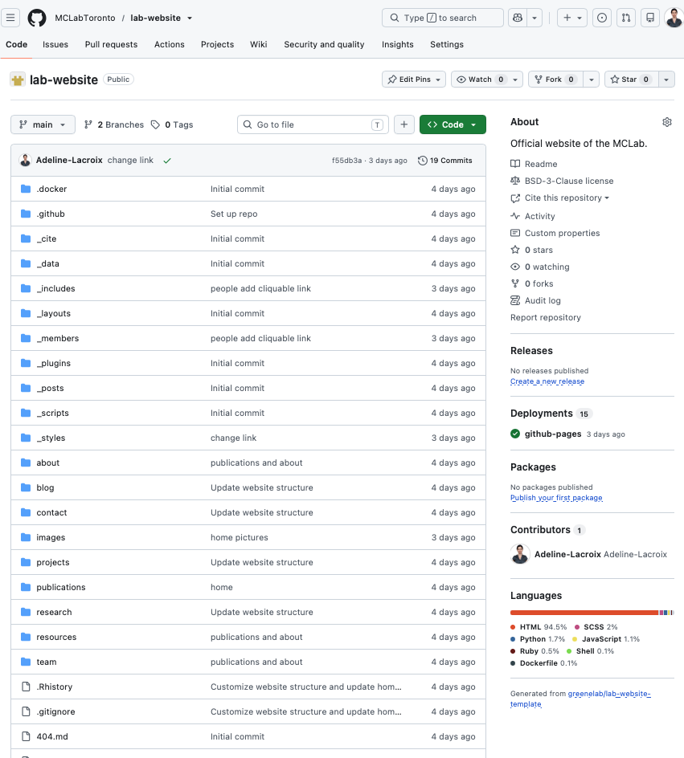
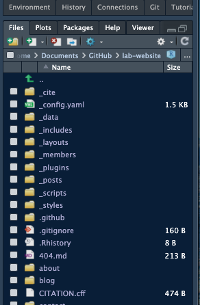
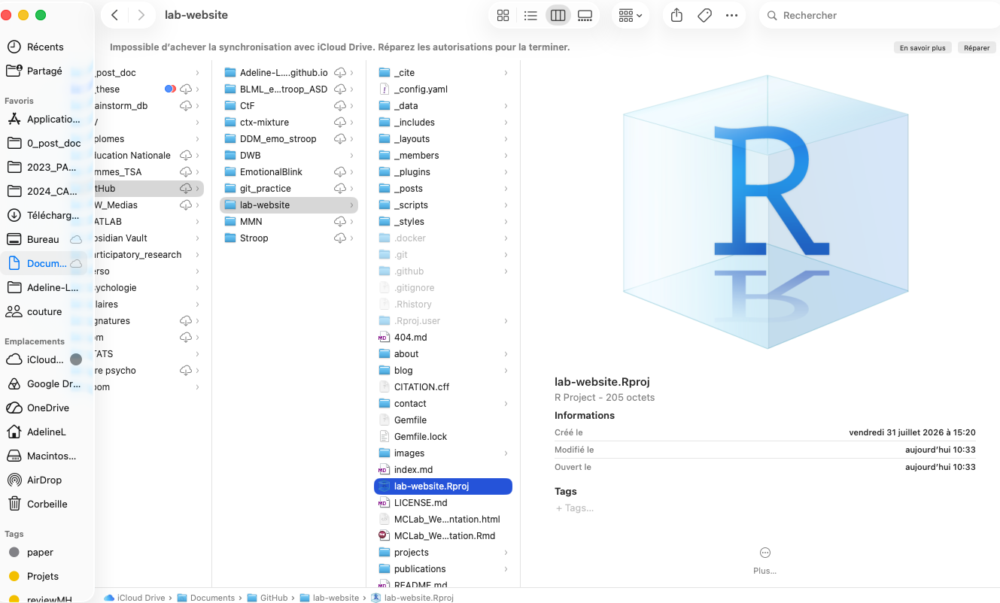
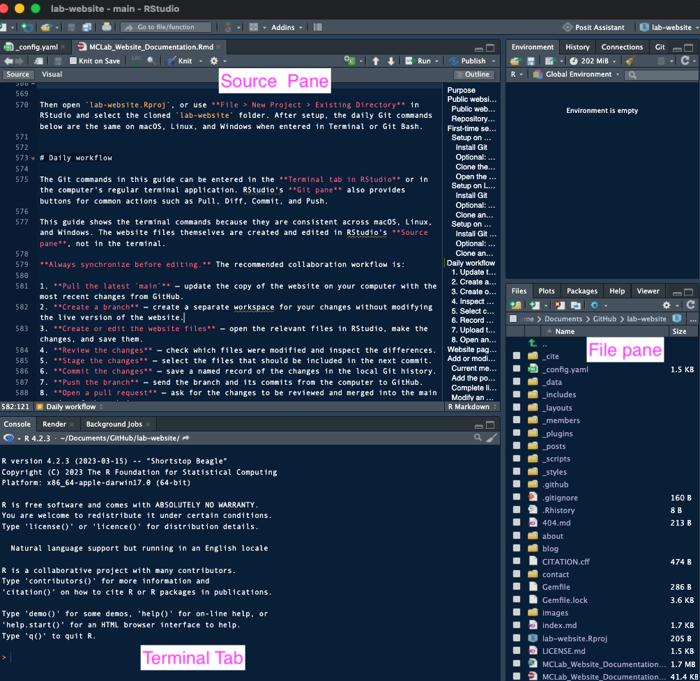
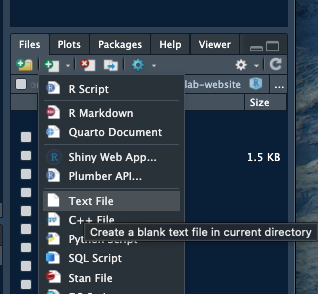
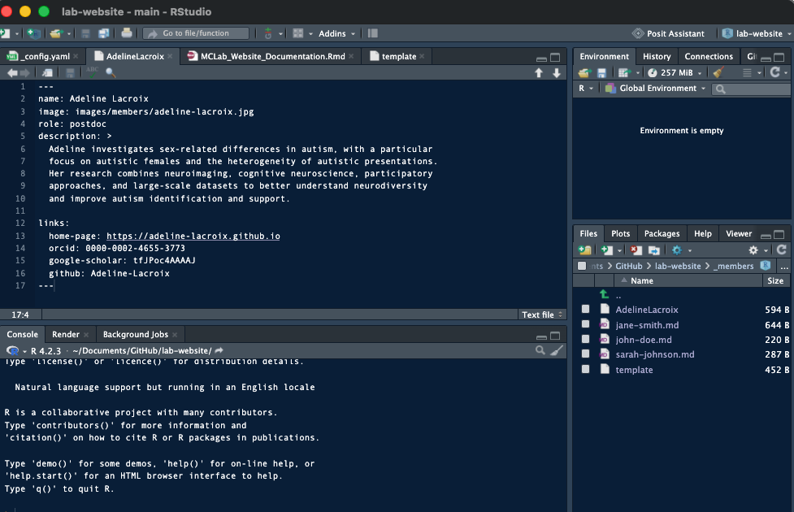
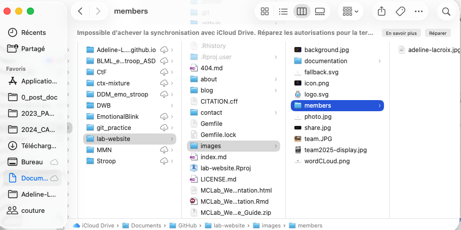

```{r setup, include=FALSE}
knitr::opts_chunk$set(
  echo = TRUE,
  eval = FALSE,
  warning = FALSE,
  message = FALSE,
  comment = ""
)
```

<style>
:root {
  --doc-ink: #344054;
  --doc-heading: #24364b;
  --doc-muted: #667085;
  --doc-accent: #5f83a6;
  --doc-accent-soft: #eef4f8;
  --doc-border: #dce5ec;
  --doc-background: #f6f8fa;
}

html { background: var(--doc-background); }

body {
  color: var(--doc-ink);
  background: var(--doc-background);
  font-family: "Avenir Next", Avenir, "Segoe UI", Helvetica, Arial, sans-serif;
  font-size: 16px;
  font-weight: 400;
  line-height: 1.7;
}

.main-container {
  max-width: 1120px;
  margin: 24px auto 48px;
  padding: 42px 56px 60px;
  background: #ffffff;
  border: 1px solid var(--doc-border);
  border-radius: 14px;
  box-shadow: 0 10px 32px rgba(36, 54, 75, 0.07);
}

h1, h2, h3, h4, h5, h6,
.title, .subtitle, .author, .date {
  color: var(--doc-heading);
  font-family: "Avenir Next", Avenir, "Segoe UI", Helvetica, Arial, sans-serif;
}

h1, h2, h3 {
  font-weight: 650;
  letter-spacing: -0.02em;
}

h1 { margin-top: 1.4em; padding-bottom: 0.22em; }
h2 { margin-top: 1.7em; }
h3 { margin-top: 1.45em; }

.title {
  margin-top: 0;
  font-size: 2.55em;
  line-height: 1.15;
}

.subtitle {
  color: var(--doc-accent);
  font-size: 1.35em;
  font-weight: 500;
}

.author, .date {
  color: var(--doc-muted);
  font-size: 0.98em;
  font-weight: 500;
}

p, li { max-width: 78ch; }
a { color: #46779f; }
a:hover, a:focus { color: #2f5878; }

blockquote {
  margin: 1.5em 0;
  padding: 16px 22px;
  color: var(--doc-ink);
  background: var(--doc-accent-soft);
  border-left: 4px solid #7fa2c0;
  border-radius: 0 8px 8px 0;
  font-size: 1em;
  font-style: normal;
}

blockquote p:last-child { margin-bottom: 0; }

pre {
  position: relative;
  padding-top: 42px;
  border: 1px solid var(--doc-border);
  border-radius: 8px;
  box-shadow: none;
}

.code-copy-button {
  position: absolute;
  top: 7px;
  right: 8px;
  padding: 4px 10px;
  border: 1px solid var(--doc-border);
  border-radius: 6px;
  color: var(--doc-heading);
  background: #ffffff;
  font-family: "Avenir Next", Avenir, "Segoe UI", Helvetica, Arial, sans-serif;
  font-size: 0.82rem;
  font-weight: 600;
  line-height: 1.3;
  cursor: pointer;
  transition: color 0.2s ease, background 0.2s ease;
}

.code-copy-button:hover,
.code-copy-button:focus-visible {
  color: #ffffff;
  background: var(--doc-accent);
  outline: none;
}

.code-copy-button[data-copied="true"] {
  color: #ffffff;
  background: #3f7d63;
}

table { border-color: var(--doc-border); }

.tocify {
  border: 0;
  border-radius: 10px;
  box-shadow: 0 5px 18px rgba(36, 54, 75, 0.08);
}

.list-group-item.active,
.list-group-item.active:hover,
.list-group-item.active:focus {
  background: var(--doc-accent);
  border-color: var(--doc-accent);
}

@media (max-width: 767px) {
  body { font-size: 15px; }

  .main-container {
    margin: 0;
    padding: 24px 20px 40px;
    border: 0;
    border-radius: 0;
    box-shadow: none;
  }

  .title { font-size: 2em; }
}
</style>

<script>
document.addEventListener("DOMContentLoaded", function () {
  document.querySelectorAll("pre > code").forEach(function (code) {
    var pre = code.parentElement;
    var button = document.createElement("button");

    button.type = "button";
    button.className = "code-copy-button";
    button.textContent = "Copy";
    button.setAttribute("aria-label", "Copy this code");

    button.addEventListener("click", function () {
      var text = code.textContent;

      function showSuccess() {
        button.textContent = "Copied!";
        button.setAttribute("data-copied", "true");
        window.setTimeout(function () {
          button.textContent = "Copy";
          button.removeAttribute("data-copied");
        }, 1600);
      }

      function fallbackCopy() {
        var textarea = document.createElement("textarea");
        textarea.value = text;
        textarea.setAttribute("readonly", "");
        textarea.style.position = "fixed";
        textarea.style.opacity = "0";
        document.body.appendChild(textarea);
        textarea.select();
        var copied = document.execCommand("copy");
        document.body.removeChild(textarea);
        if (copied) showSuccess();
      }

      if (navigator.clipboard && window.isSecureContext) {
        navigator.clipboard.writeText(text).then(showSuccess).catch(fallbackCopy);
      } else {
        fallbackCopy();
      }
    });

    pre.appendChild(button);
  });
});
</script>

# Purpose

This document explains how MCLab members can maintain the laboratory website safely and collaboratively. It is intended for both first-time contributors and regular editors. If anyone wants to modify this document, the source file is editable in RStudio and can be rendered as an HTML document with a floating table of contents.

The website repository is hosted in the **MCLabToronto** GitHub organization. The public website is currently available at:

<https://mclabtoronto.github.io/lab-website>

Use this guide to:

- set up Git and GitHub access on macOS, Linux, or Windows;
- understand what visitors see versus how the repository is organized;
- update people, publications, news, text, and images;
- collaborate through branches and pull requests;
- understand automatic deployment; and
- diagnose common problems.

> **Important:** The repository architecture described here reflects the current version of the website. It may evolve following suggestions from members of the lab. Some template folders and files support the website internally but do not correspond to pages or content that visitors can see publicly.

# Public website structure versus repository architecture

These two structures are related, but they are not the same.

## Public website structure

The public structure is the set of pages and navigation items seen by visitors in a browser. At present, it includes the home page and sections such as About, Research, Projects, People, Publications, News, and Resources.

## Repository architecture

The repository you will access using GitHub and/or R (see screenshots below) contains source content, configuration, templates, styling, scripts, and automation. Jekyll is a tool that combines these elements to generate the public site.

| Repository path | Main purpose | Publicly visible as-is? |
|---|---|---|
| `index.md` | Home-page source | Its rendered content is visible |
| `about/`, `research/`, `projects/`, `team/`, `blog/`, `resources/`, `contact/` | Sources for major pages | Their rendered pages are visible |
| `publications/index.md` | Single publications page, organized by year | Its rendered content is visible |
| `_members/` | One YAML/Markdown record per person | Rendered into People profiles/pages |
| `_posts/` | Dated news items | Rendered into the News section |
| `images/` | Site images; member portraits are in `images/members/` | Images may be visible when referenced |
| `_config.yaml` | Global Jekyll settings, collections, and defaults | No |
| `_includes/` and `_layouts/` | Reusable HTML/Liquid components and page layouts | No; only their generated output |
| `_styles/` and `_scripts/` | Appearance and browser behaviour | No; their effects are visible |
| `_data/` and `_cite/` | Structured data and citation tooling | No; generated publication data may be used |
| `.github/workflows/` | GitHub Actions for building, previews, and deployment | No |
| `Gemfile` and `Gemfile.lock` | Ruby/Jekyll dependencies | No |

Folders beginning with an underscore usually have a special role in Jekyll. **Do not delete template files** simply because they are not displayed in the navigation.

<div style="display: flex; align-items: flex-start; justify-content: center; gap: 20px; flex-wrap: wrap;">
  <figure style="flex: 1 1 500px; margin: 0;">
    
    <figcaption style="margin-top: 8px; text-align: center;">
      Repository on GitHub
    </figcaption>
  </figure>

  <figure style="flex: 0 1 350px; margin: 0;">
    
    <figcaption style="margin-top: 8px; text-align: center;">
      Repository in RStudio
    </figcaption>
  </figure>
</div>

# First-time setup

Complete this section once on each computer used to edit the website. The GitHub account, organization membership, Git concepts, repository content, and daily workflow are the same on macOS, Linux, and Windows. The main differences concern installation, the terminal application, and secure storage of credentials.

**Shared prerequisite: create a GitHub account (if you do not have one yet)**

1. Go to <https://github.com> and create an account, preferably using a professional email address.
2. Verify the email address.
3. Enable two-factor authentication and save the recovery codes securely.
4. Send the GitHub username to a website administrator.

**Shared prerequisite: join the MCLabToronto organization**

An owner of **MCLabToronto** must invite the contributor. The invitation may arrive by email and is also normally visible at <https://github.com/orgs/MCLabToronto/invitation>.

Accept the invitation and confirm that the repository is visible. The account must have suitable repository permission to push a branch or open a pull request. If the invitation has expired, ask an organization owner to resend it.

> **Screenshot placeholder — organization invitation:** Insert a screenshot showing where to accept the MCLabToronto invitation.

**Choose how Git connects to GitHub**

Git can connect to the MCLab repository using either **HTTPS** or **SSH** (section 3.1.2). Both methods provide access to the same files and use the same daily commands. The choice only changes how GitHub authenticates the contributor.

| | HTTPS | SSH |
|---|---|---|
| Recommended for | Most contributors and first-time Git users | Contributors who already use SSH or prefer key-based access |
| Initial setup | Minimal | Requires creating and registering an SSH key |
| Daily editing in RStudio | Identical | Identical |
| Authentication | GitHub may open a browser when authentication is required; credentials are normally remembered securely | The computer uses the registered SSH key; its passphrase may be remembered by a keychain or agent |
| Repository address | `https://github.com/MCLabToronto/lab-website.git` | `git@github.com:MCLabToronto/lab-website.git` |

> **Recommended for most contributors:** Start with HTTPS. It is simpler and does not require creating an SSH key. SSH is optional and can be configured later without recloning the repository.

The choice does **not** affect how website files are edited, saved, committed, reviewed, or deployed. After authentication is configured, the everyday workflow is the same.

## Setup on macOS

### Install Git

Open **Terminal** (Applications > Utilities > Terminal) and check whether Git is installed:

```{bash}
git --version
```

If macOS prompts for the Command Line Tools, accept the installation. Git can also be installed with Homebrew, if Homebrew is already used on the computer:

```{bash}
brew install git
```

Set the name and email. Use an email connected to the GitHub account.

```{bash}
git config --global user.name "Your Full Name"
git config --global user.email "your-email@example.com"
git config --global init.defaultBranch main
```

Check the settings (should be the same as set above):

```{bash}
git config --global --list
```

### Optional: configure SSH access

Skip this subsection when using the recommended HTTPS method. SSH allows Git to authenticate using a registered key instead of a browser-based HTTPS sign-in.

First, check for an existing key:

```{bash}
ls -al ~/.ssh
```

If an appropriate key such as `id_ed25519` and `id_ed25519.pub` already exists and is used for GitHub, do not overwrite it. Otherwise, create a new Ed25519 key:

```{bash}
ssh-keygen -t ed25519 -C "your-email@example.com"
```

Press Return to accept the default path. Use a secure passphrase.

Start the SSH agent and add the private key to the macOS Keychain:

```{bash}
eval "$(ssh-agent -s)"
ssh-add --apple-use-keychain ~/.ssh/id_ed25519
```

Create or edit `~/.ssh/config` so it contains the following entry:

```text
Host github.com
  HostName github.com
  User git
  AddKeysToAgent yes
  UseKeychain yes
  IdentityFile ~/.ssh/id_ed25519
```

Copy the public key:

```{bash}
pbcopy < ~/.ssh/id_ed25519.pub
```

On GitHub, open **Settings > SSH and GPG keys > New SSH key**, give the key a descriptive title, paste it, and save it.

Test the connection:

```{bash}
ssh -T git@github.com
```

The first connection may ask whether to trust GitHub's host key. Verify the fingerprint against GitHub's documentation before accepting it. A successful test identifies the GitHub username and notes that GitHub does not provide shell access.


### Clone the repository

Cloning creates a complete local working copy (with its Git history) on your computer that you can work on anytime. Do not download a ZIP for routine collaboration because a ZIP is not connected to the Git repository.

Choose a parent folder, such as `~/Documents/GitHub`.

**Option A — HTTPS (recommended):**

```{bash}
mkdir -p ~/Documents/GitHub
cd ~/Documents/GitHub
git clone https://github.com/MCLabToronto/lab-website.git
cd lab-website
git status
```


When authentication is required (usually during the first `git pull` or `git push` that yo will discover later), GitHub will normally open a browser window. Sign in to your GitHub account and follow the instructions shown on screen.


**Option B — SSH (only after completing the optional SSH setup above):**

```{bash}
mkdir -p ~/Documents/GitHub
cd ~/Documents/GitHub
git clone git@github.com:MCLabToronto/lab-website.git
cd lab-website
git status
```


### Open the repository in RStudio

The repository already contains `lab-website.Rproj`. It can be opened directly. If using RStudio's directory workflow:

1. Open RStudio.
2. Select **File > New Project > Existing Directory**.
3. Browse to `~/Documents/GitHub/lab-website`.
4. Select **Create Project**.

Confirm that the Files pane shows repository items such as `_members`, `_posts`, `images`, and `_config.yaml`. The Git pane should also be available once Git is detected.

<div style="text-align: center;">
  
  <p style="margin-top: 8px;">
    Local copy of the MCLab website repository with the R project
  </p>
</div>


## Setup on Linux

On Linux, the GitHub account, MCLabToronto invitation, repository address, branch workflow, and RStudio workflow are the same. Package installation varies by distribution.

### Install Git

On Ubuntu, Debian, Linux Mint, or a related distribution:

```{bash}
sudo apt update
sudo apt install git
```

On Fedora or a related distribution:

```{bash}
sudo dnf install git
```

On Arch Linux or Manjaro:

```{bash}
sudo pacman -S git
```

Verify Git and configure the contributor identity:

```{bash}
git --version
git config --global user.name "Your Full Name"
git config --global user.email "your-email@example.com"
git config --global init.defaultBranch main
```

### Optional: configure SSH access

Skip this subsection when using HTTPS. When using SSH, first install the SSH client if it is not already available (`openssh-client` on Ubuntu/Debian, `openssh-clients` on Fedora, or `openssh` on Arch Linux). Then check whether an appropriate GitHub key already exists before creating a new one:

```{bash}
ls -al ~/.ssh
ssh-keygen -t ed25519 -C "your-email@example.com"
```

Accept the default file location and use a secure passphrase. Start `ssh-agent` and add the private key for the current session:

```{bash}
eval "$(ssh-agent -s)"
ssh-add ~/.ssh/id_ed25519
```

Display the public key:

```{bash}
cat ~/.ssh/id_ed25519.pub
```

Copy the entire displayed line and add it on GitHub under **Settings > SSH and GPG keys > New SSH key**. Never copy, upload, or share the private file `~/.ssh/id_ed25519`.

Test the GitHub connection:

```{bash}
ssh -T git@github.com
```

Some Linux desktop environments provide a keyring that can remember the SSH passphrase. The exact integration varies by distribution and desktop environment. It is also acceptable to add the key to `ssh-agent` after signing in.

### Clone and open the project

Choose a suitable folder.

**Option A — HTTPS (recommended):**

```{bash}
mkdir -p ~/Documents/GitHub
cd ~/Documents/GitHub
git clone https://github.com/MCLabToronto/lab-website.git
cd lab-website
git status
```

Depending on the Linux distribution and credential manager, GitHub may open a browser or request that authentication be completed through a browser. The normal GitHub account password cannot be used as a Git password.

**Option B — SSH (only after completing the optional SSH setup above):**

```{bash}
mkdir -p ~/Documents/GitHub
cd ~/Documents/GitHub
git clone git@github.com:MCLabToronto/lab-website.git
cd lab-website
git status
```

Install the current Linux version of RStudio Desktop appropriate for the distribution, then open `lab-website.Rproj`. Alternatively, select **File > New Project > Existing Directory** and choose the cloned `lab-website` folder.

After setup, the daily Git commands in the next section are the same on Linux, macOS, and Windows.


## Setup on Windows

On Windows, the GitHub account, MCLabToronto invitation, repository address, branch workflow, and RStudio steps are the same. Use the following Windows-specific setup instead of the macOS Git and Keychain commands above.

### Install Git for Windows

1. Download **Git for Windows** from <https://git-scm.com/download/win>.
2. Run the installer. The default choices are appropriate for most contributors.
3. Keep **Git Bash** enabled. It provides a terminal in which most commands in this guide work exactly as written.
4. Open Git Bash and verify the installation:

```{bash}
git --version
```

Configure the contributor identity in Git Bash:

```{bash}
git config --global user.name "Your Full Name"
git config --global user.email "your-email@example.com"
git config --global init.defaultBranch main
```

### Optional: configure SSH on Windows

Skip this subsection when using HTTPS. Git for Windows includes Git Credential Manager, which normally handles HTTPS authentication through the browser and stores the resulting credential securely. To use SSH instead, open Git Bash, check for an existing key, and create one only if needed:

```{bash}
ls -al ~/.ssh
ssh-keygen -t ed25519 -C "your-email@example.com"
```

Accept the default file location and use a secure passphrase. Start the agent and add the key for the current Git Bash session:

```{bash}
eval "$(ssh-agent -s)"
ssh-add ~/.ssh/id_ed25519
```

Copy the public key to the Windows clipboard:

```{bash}
clip < ~/.ssh/id_ed25519.pub
```

Add it on GitHub under **Settings > SSH and GPG keys > New SSH key**, then test it:

```{bash}
ssh -T git@github.com
```

Windows does not use the macOS Keychain. Git for Windows includes Windows-compatible credential tools, and SSH keys can be managed with the Windows `ssh-agent` service if persistent loading is desired. A contributor who is unsure should use Git Bash and ask the website administrator for help rather than copying or sharing a private key. Only the `.pub` file may be added to GitHub.

### Clone and open the project on Windows

In Git Bash, a convenient location is the `Documents/GitHub` folder.

**Option A — HTTPS (recommended):**

```{bash}
cd ~/Documents
mkdir -p GitHub
cd GitHub
git clone https://github.com/MCLabToronto/lab-website.git
cd lab-website
git status
```

Git Credential Manager should open a browser when GitHub authentication is required. Sign in to the correct GitHub account and authorize access. It normally remembers the credential, so this is not repeated for every `pull` or `push`.

**Option B — SSH (only after completing the optional SSH setup above):**

```{bash}
cd ~/Documents
mkdir -p GitHub
cd GitHub
git clone git@github.com:MCLabToronto/lab-website.git
cd lab-website
git status
```

Then open `lab-website.Rproj`, or use **File > New Project > Existing Directory** in RStudio and select the cloned `lab-website` folder. After setup, the daily Git commands below are the same on macOS, Linux, and Windows when entered in Terminal or Git Bash.


# Daily workflow

The Git commands in this guide can be entered in the **Terminal tab in RStudio** or in the computer's regular terminal application.

This guide shows the terminal commands because they are consistent across macOS, Linux, and Windows. The website files themselves are created and edited in RStudio's **Source pane**, not in the terminal.

<div style="text-align: center;">
  
  <p style="margin-top: 8px;">
    Main RStudio panes used to edit the website and run Git commands
  </p>
</div>

There are two possible workflows. The **simple workflow** is suitable for small, routine content updates when direct changes to `main` are allowed. The **branch workflow** provides an additional review step and is safer for larger or structural changes.

## Workflow A — Direct changes to `main` (simplest)

Use this workflow for small updates such as editing your profile, adding a publication, correcting text, or replacing an image.

1. **Pull** — update the website copy on your computer.
2. **Edit and save** — modify the relevant files in RStudio.
3. **Check and stage** — review the changed files and select them for the commit.
4. **Commit** — save a named record of the changes on your computer.
5. **Pull again** — check whether someone published changes while you were working.
6. **Push** — send the commit directly to `main` on GitHub.

### A1. Update the local copy

```{bash}
git switch main
git pull origin main
```

`git switch main` moves to the main version of the website. `git pull origin main` updates the copy on your computer with the latest changes from GitHub. Always do this before editing.

### A2. Create or edit the website files

In RStudio:

1. Use the **Files pane** to locate the relevant file.
2. Click the file to open it in the **Source pane**.
3. Edit the text or code. More detailed examples for member profiles, publications, news, and images are provided in later sections.
4. Save the file.

New files can be created with **File > New File > Text File** and then saved in the appropriate repository folder with the correct filename and extension.

<div style="text-align: center;">
  
  <p style="margin-top: 8px;">
    Create a new file
  </p>
</div>

### A3. Check and stage the changes

```{bash}
git status
git add .

```

- `git status` lists the files that have changed.
- `git diff` (optionnal) displays the changed lines for review. to quit: q
- `git add .` selects all new and modified files for the next commit. It does not upload them.
- The final `git status` shows exactly what will be included in the commit.

To select only specific files instead, use:

```{bash}
git add path/to/file
```

> **Added the wrong file?**
>
> Use `git restore --staged path/to/file` to remove one file from the next commit, or `git restore --staged .` to remove all staged files. The edits remain saved on the computer.

### A4. Commit the changes

```{bash}
git commit -m "Update my profile"
```

The `-m` option adds a short description to the commit. The commit is still stored only on the computer at this stage.

### A5. Check for recent changes and push

Before publishing, check once more whether someone else updated `main` while you were working:

```{bash}
git pull origin main
git push origin main
```

If no conflicting changes are found, Git combines compatible updates automatically and the push proceeds normally. If Git reports a **merge conflict**, do not force the push. Review the conflicting file with the colleague involved or ask the website administrator for help.

Once the push succeeds, GitHub automatically rebuilds the public website. The update may take a few minutes to appear.

## Workflow B — Branch and pull request

Use this workflow for larger changes, changes to the website structure or styling, work that should be reviewed before publication, or situations where several people may edit the same area.

A branch is a separate workspace based on `main`. Changes pushed to the branch do not appear on the public website until the branch is reviewed and merged into `main`.

1. **Update `main`**:

```{bash}
git switch main
git pull origin main
```

2. **Create a working branch** with a short, meaningful name:

```{bash}
git switch -c update-adeline-profile
```

3. **Edit, save, check, stage, and commit** the files as described in steps A2–A4 above.

4. **Push the new branch** to GitHub:

```{bash}
git push -u origin update-adeline-profile
```

The `-u` option links the local branch to the corresponding branch on GitHub. Later pushes from the same branch can normally use only `git push`.

5. **Open a pull request on GitHub**:

   - Open the repository on GitHub.
   - Select **Compare & pull request**, or open **Pull requests > New pull request**.
   - Confirm that the base is `main` and the comparison branch is your working branch.
   - Review the changed files and automated checks.
   - Select **Merge pull request** when the changes are ready.

A pull request is created once for the complete branch, not after every individual edit or commit. Additional commits pushed to the same branch are automatically added to the open pull request.

After the pull request has been merged:

```{bash}
git switch main
git pull origin main
git branch -d update-adeline-profile
```

> **What happens if two people work at the same time?**
>
> If they edit different files or different parts of a file, Git can usually combine the changes automatically. If they edit the same lines, Git reports a **merge conflict** during a pull or merge. A branch does not completely prevent conflicts, but it allows the changes to be reviewed and resolved before they affect the public website. In either workflow, communicate about major changes and pull the latest `main` before starting.

> **Using RStudio's Git pane:** Contributors can use the Git pane for common actions such as Pull, Diff, Commit, and Push. The terminal commands are shown here because they remain consistent across macOS, Linux, and Windows.

# Website pages

Most main pages are Markdown files with YAML front matter at the top. The current site includes:

| Public page | Main source |
|---|---|
| Home | `index.md` |
| About | `about/index.md` |
| Research | content under `research/` |
| Projects | `projects/index.md` and `_data/projects.yaml` |
| People | `team/index.md` plus `_members/` |
| Publications | `publications/index.md` |
| News | `blog/index.md` plus `_posts/` |
| Resources | `resources/index.md` |
| Contact | `contact/index.md` |

The YAML block between the opening and closing `---` controls metadata such as the page title and navigation order. The content below it is Markdown mixed, where necessary, with Liquid/HTML template code.

File and folder names are case-sensitive on GitHub. Preserve the repository's current names exactly unless a deliberate migration is planned.

# Add or modify a member

## Current member template

Member records live in `_members/`. Start from `_members/template`, make a new file with a unique, readable name, and complete the YAML fields.

```yaml
---
# Full name
name: Jane Doe

# Profile photo
image: images/members/jane-doe.jpg

# Member role (choose ONE ; it will be used to classify members): pi, postdoc, phd, master, or staff
role: phd

# Short research description (2–4 sentences)
description: >
  Jane studies an example research topic using collaborative and
  interdisciplinary methods. Her work focuses on a concise description
  written for a general audience.

links:
  home-page: https://example.org
  orcid: 0000-0000-0000-0000
  google-scholar: ExampleScholarID
  github: example-username
---
```

The roles currently displayed by `team/index.md` are:

- `pi` — Lab Head;
- `postdoc` — Postdoctoral Fellows;
- `phd` — PhD Students;
- `master` — Master's Students; and
- `staff` — Research Staff.

Role values must be lowercase and exactly match one of these codes. Although the underlying template may contain or support other values such as `alumni`, a role appears publicly only when the People page contains a corresponding filtered section.

## Add the portrait

1. Prepare a clear square or easily cropped portrait, ideally in JPG or PNG format.
2. Use a lowercase descriptive filename such as `jane-doe.jpg`; avoid spaces and accents.
3. Place it in `images/members/`.
4. Set `image:` to the exact relative path and match the filename's capitalization.

The current portrait design crops images to a circle. Keep the face reasonably centered and avoid placing important content near the corners.

## Complete links correctly

- `home-page` requires the complete URL, including `https://`.
- `orcid` requires the ORCID identifier, not necessarily the full URL.
- `google-scholar` requires the scholar ID, not the entire profile URL.
- `github` requires the username only.
- Leave a value empty if the person does not have that profile; do not invent placeholder links in a live record.

## Modify an existing member

Edit the person's existing file rather than creating a duplicate. If the portrait is replaced but keeps the same filename, browser caching may temporarily display the old image. A new descriptive filename and matching YAML update make the change unambiguous.

Validate the opening and closing `---`, indentation, colon placement, and spelling of `role`. YAML errors can stop the site build.

<div style="display: flex; align-items: flex-start; justify-content: center; gap: 20px; flex-wrap: wrap;">
  <figure style="flex: 1 1 500px; margin: 0;">
    
    <figcaption style="margin-top: 8px; text-align: center;">
      Example of a member file
    </figcaption>
  </figure>

  <figure style="flex: 0 1 500px; margin: 0;">
    
    <figcaption style="margin-top: 8px; text-align: center;">
      Where to add your pic
    </figcaption>
  </figure>
</div>

# Add a publication

The current website uses **one publications page**, `publications/index.md`, with publications grouped manually under year headings. Do not create a separate page for each year unless the lab intentionally changes the architecture.

1. Open `publications/index.md`.
2. Find the newest year heading or add it above older years.
3. Add the reference as a Markdown list item.
4. Italicize journal or title elements consistently with existing entries.
5. Add the DOI as a clickable HTTPS link when available.

```markdown
## 2026

- Doe, J., & Smith, A. (2026). *Title of the article*. *Journal Name, 12*(3), 100–110. [https://doi.org/10.xxxx/example](https://doi.org/10.xxxx/example)

## 2025

- Existing older publication...
```

Keep reverse chronological order: newest year first and, preferably, newest item first within a year. Confirm author names, year, title, journal, volume, issue, pages/article number, and DOI against the final publication record.

The repository also contains citation automation and data under `_cite/` and `_data/`. Those template mechanisms exist even though the current public publications page is maintained as a single year-organized page. Do not edit generated citation data unless the selected maintenance workflow specifically requires it.


# Add a news item

News items are Markdown files in `_posts/`. The filename must start with an ISO date:

```text
YYYY-MM-DD-short-descriptive-title.md
```

For example:

```text
2026-09-15-autism-conference-presentation.md
```

Use front matter consistent with the current posts:

```yaml
---
title: MCLab presents at the 2026 Autism Research Conference
image: images/conference-2026.jpg
author: adeline-lacroix
tags: conference, presentation, autism
---

MCLab members presented their recent work at the 2026 Autism Research
Conference. Add a concise, accessible account of the event here.
```

The date in the filename controls post chronology. The `author` should correspond to a valid member identifier expected by the template; inspect existing working posts and member filenames before choosing it. The image path must exist. Tags are comma-separated in the current examples.

Use meaningful link text rather than pasting long URLs into the prose:

```markdown
Read the [conference programme](https://example.org/programme) for details.
```


# Replace images

Images are stored under `images/`, with portraits under `images/members/`. To replace an image:

1. Identify the exact source file that references it by searching the repository for its filename.
2. Prepare an optimized JPG, PNG, SVG, or WebP appropriate to the use.
3. Use a lowercase, descriptive filename without spaces when adding a new asset.
4. Add the image under `images/` or its relevant subfolder.
5. Update every reference to match the path and capitalization exactly.
6. Review both desktop and mobile layouts in the generated preview.

Example Markdown:

```markdown

```


Always include useful alternative text. Compress very large photographs before committing them. Be careful with `team.JPG`: changing `.JPG` to `.jpg` without renaming the actual file breaks the image on GitHub's case-sensitive environment.

## Control the displayed image size

HTML/Liquid can be used when the displayed width or alignment of an image must be controlled.

```html
<div style="max-width: 850px; margin: 30px auto;">
  
</div>
```

In this example:

- `max-width: 850px` sets the maximum displayed width of the image container.
- `width: 100%` makes the image fill the available width of its container.
- `height: auto` preserves the original proportions of the image.
- `margin: 30px auto` adds vertical space and centres the image horizontally.
- `border-radius: 4px` slightly rounds the corners.

To display a smaller image, reduce `max-width`:

```html
<div style="max-width: 500px; margin: 30px auto;">
```

To display a larger image, increase it:

```html
<div style="max-width: 1000px; margin: 30px auto;">
```

In most cases, keep `height: auto`. Setting both a fixed width and a fixed height can stretch or distort the image.

### Display two images side by side

Use a flexible container to place two images on the same row:

```html
<div style="display: flex; align-items: flex-start; justify-content: center; gap: 20px; flex-wrap: wrap;">

  <figure style="flex: 1 1 500px; margin: 0;">
    
    <figcaption style="margin-top: 8px; text-align: center;">
      Caption for the first image
    </figcaption>
  </figure>

  <figure style="flex: 1 1 350px; margin: 0;">
    
    <figcaption style="margin-top: 8px; text-align: center;">
      Caption for the second image
    </figcaption>
  </figure>

</div>
```

In this example:

- `display: flex` places the images next to each other.
- `gap: 20px` controls the space between them.
- `flex-wrap: wrap` moves the second image below the first on a narrow screen.
- `flex: 1 1 500px` and `flex: 1 1 350px` give the images different preferred widths.
- Use the same value for both figures if the images should have approximately equal widths.
- The `<figcaption>` elements are optional and can be removed when captions are not needed.

# Website publication

Changes made on your computer do not immediately appear on the public website.

The website is updated automatically after the changes have been:

1. committed;
2. pushed to GitHub; and
3. merged into the `main` branch.

GitHub then rebuilds and publishes the website. This process is called **deployment** and may take a few minutes.

To check whether the update was successful:

1. Open the repository on GitHub.
2. Select the **Actions** tab.
3. Open the most recent workflow.

A green check mark means that the website was built successfully. A red cross means that an error occurred. If an error appears, contact the website administrator and share a screenshot or link to the failed workflow.

> Do not manually modify the `gh-pages` branch or the generated `_site` folder. These are managed automatically.

# Troubleshooting

## The public site did not update

Check these points in order:

1. Run `git status`. Confirm the intended changes were committed, not merely saved locally.
2. Run `git log -1 --oneline`. Confirm the latest local commit is the expected one.
3. Confirm the commit was pushed and appears on GitHub.
4. Confirm the change was merged into `main`; a branch or open pull request does not update the live site.
5. Open GitHub **Actions** and check the latest `on-push` and build jobs.
6. Wait a few minutes after a successful deployment, then reload the site.
7. Perform a hard refresh or use a private browser window to rule out cached content or images.
8. Confirm that the expected URL is being viewed, not an old pull-request preview.

Useful comparison commands:

```{bash}
git status
git branch --show-current
git log -1 --oneline
git fetch origin
git status -sb
```

## Jekyll or Liquid build error

Open the failed GitHub Actions step and read the first meaningful error, including its file and line number. Later messages are often consequences of the first problem.

Common causes include:

- missing or unmatched `---` around YAML front matter;
- incorrect YAML indentation or a colon in unquoted text;
- an invalid role, missing required value, or malformed list;
- unclosed Liquid syntax such as `` or `{{ ... }}`;
- an unclosed HTML tag;
- a missing include or layout;
- a filename/path capitalization mismatch; and
- references to an image that was not committed.

Inspect the precise change:

```{bash}
git diff
git diff --check
```

If Ruby and Bundler are installed locally, reproduce the production build from the repository root:

```{bash}
bundle install
bundle exec jekyll build
```

For a local server:

```{bash}
bundle exec jekyll serve
```

Then open the local address reported in Terminal. Stop the server with **Control-C**. Local build tooling is helpful but not required for ordinary edits because the pull-request workflow provides a preview.

## HTTPS authentication fails

```{bash}
git remote -v
```

Confirm that the remote address begins with `https://github.com/`. When GitHub opens a browser, sign in with the GitHub account that belongs to MCLabToronto and authorize access. If the terminal requests a password, the normal GitHub account password will not work. Use the browser-based flow provided by the system's credential manager, or ask the website administrator for help configuring it.

To deliberately change an existing SSH remote to the recommended HTTPS address:

```{bash}
git remote set-url origin https://github.com/MCLabToronto/lab-website.git
```

Changing the remote address does not delete local files, branches, or commits.

## SSH authentication fails

```{bash}
ssh -T git@github.com
ssh-add -l
git remote -v
```

Confirm that the public key is attached to the correct GitHub account, the private key is loaded, and the remote begins with `git@github.com:`. If Git uses an HTTPS remote, either authenticate over HTTPS or deliberately change it to SSH:

```{bash}
git remote set-url origin git@github.com:MCLabToronto/lab-website.git
```

## Push is rejected

A rejection often means that GitHub contains newer commits or the branch is protected. Do not force-push to `main`.

For a normal working branch, first save/commit the current work, update `main`, and integrate it carefully:

```{bash}
git switch main
git pull origin main
git switch your-branch-name
git merge main
```

Resolve any conflicts, test the files, then commit the resolution and push. If branch protection requires a pull request, open one rather than pushing directly to `main`.

## Merge conflict

Git marks conflicting areas with `<<<<<<<`, `=======`, and `>>>>>>>`. Read both versions, keep the correct combined content, remove all markers, then stage and commit the resolved file.

```{bash}
git status
git add path/to/resolved-file
git commit -m "Resolve merge conflict"
git push
```

Ask another maintainer for review if the conflict affects templates, workflows, configuration, or unfamiliar code.

## Image is missing or outdated

- Verify the path and exact capitalization.
- Confirm the image was included in the commit and push.
- Check that the page references the repository-relative image path.
- Reload without cache or use a new filename if a same-name replacement is cached.
- Avoid spaces and special characters in new filenames.

# Git command reference

| Command | Purpose |
|---|---|
| `git clone https://github.com/MCLabToronto/lab-website.git` | Create the initial local copy using HTTPS (recommended) |
| `git clone git@github.com:MCLabToronto/lab-website.git` | Create the initial local copy using SSH (optional) |
| `git status` | Show branch and working-tree state without changing anything |
| `git switch main` | Switch to the main branch |
| `git pull origin main` | Download and integrate the latest `main` commits |
| `git switch -c branch-name` | Create and switch to a new branch |
| `git branch --show-current` | Print the current branch name |
| `git diff` | Review unstaged changes |
| `git diff --staged` | Review staged changes |
| `git add path/to/file` | Stage a selected file for the next commit |
| `git commit -m "Message"` | Record staged changes locally |
| `git push -u origin branch-name` | Publish a new branch and set its upstream |
| `git push` | Publish later commits on a tracked branch |
| `git fetch origin` | Download remote information without integrating it |
| `git log --oneline --decorate -10` | Show a compact recent history |
| `git remote -v` | Show remote repository addresses |
| `git restore --staged path/to/file` | Remove a file from staging without deleting its edits |
| `git branch -d branch-name` | Delete a fully merged local branch |

Use destructive or history-rewriting commands only when their consequences are fully understood. In particular, colleagues should not use `git push --force`, `git reset --hard`, or manual changes to `gh-pages` as routine troubleshooting.

# Final pre-pull-request checklist

- The branch began from an up-to-date `main`.
- Only files relevant to the change were edited.
- New filenames contain no spaces and use consistent capitalization.
- YAML front matter has valid delimiters and indentation.
- Image and link paths are correct.
- Member roles use the exact supported lowercase code.
- Publications are in the correct year and order.
- News filenames begin with `YYYY-MM-DD-`.
- `git diff` and `git status` show no accidental changes.
- The commit message clearly describes the change.
- The branch was pushed and a pull request was opened.
- Automated checks and the preview were reviewed before merging.

# Maintaining this documentation

Update this file when the website structure, member schema, contribution policy, or deployment process changes. Because the architecture may evolve in response to lab feedback, confirm examples against the current repository before relying on them for major changes. Keep screenshots current and avoid documenting template internals as public features unless those features are actually enabled on the MCLab website.
